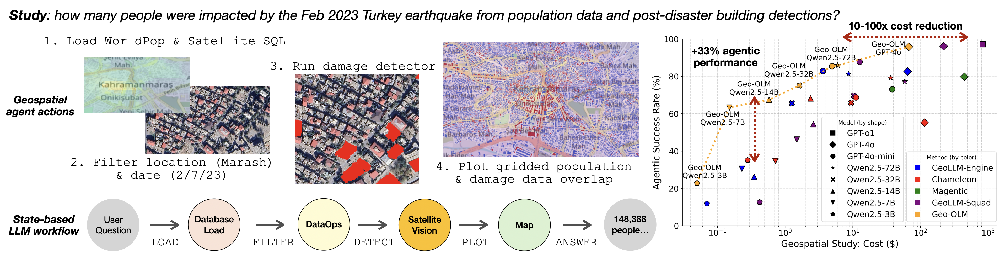

# Geo-OLMs Repo




## Setup
1. Clone this repo

2. Setup OpenAI API key and store in environment variable ``OPENAI_API_KEY`` (see [OpenAI API Dev Quickstart](https://platform.openai.com/docs/quickstart/step-2-setup-your-api-key?api-mode=chat)).
```bash
export OPENAI_API_KEY='your-api-key-here'
```

3. Install requirements: slight chance the list isn't up-to-date! need to check, so better that you install inside a virtualenv
```bash
pip3 install -r requirements.txt
```


## Data

We consider several open-source datasets (xview1, ...). For agentic experimentation purposes, we're not directly touching the underlying imagery or SQL tables. Instead the list of images with their metadata (dates, coordinates, etc.) are preprocessed into DataFrames. The instructions how ingest each dataset can be found under `datasets/geeo`.

** Note: We've preprocessed the files. The link to download the `*.gpkg` files is [send over email]. Unzip this and have all files under `datasets/gpkgs/geeo25`.


## Getting Started [WiP]
The `main.py` launches the geo-agent. We are updating the flow by adding config file support, but for now:

```bash
python main.py
```

## Evaluation [WiP]

Output is stored under `./results/`. We are updating the flow on how metrics are reported, but for now:

```bash
python3 run_eval.py
```


## Citation

```bibtex
@inproceedings{stamoulis2025geoolm,
  title={Geo-OLM: Enabling Sustainable Earth Observation Studies with Cost-Efficient Open Language Models \& State-Driven Workflows},
  author={Stamoulis, Dimitrios and Marculescu, Diana},
  booktitle={ACM Computing and Sustainable Societies (COMPASS)},
  year={2025},
  note = {(Accepted)}
}
```